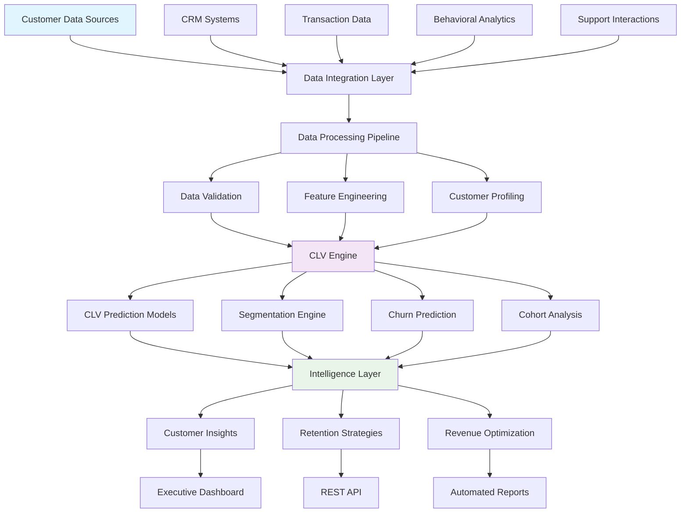
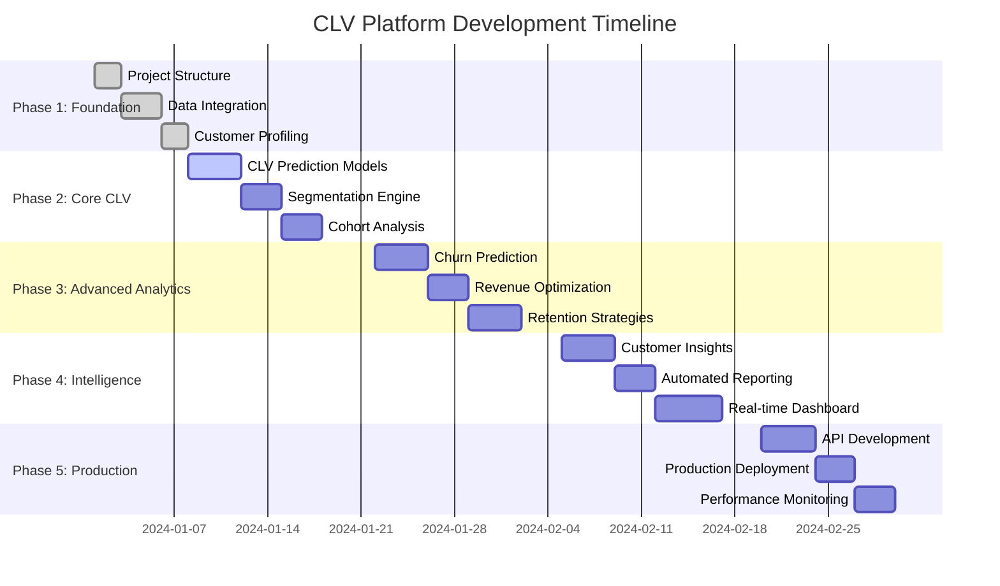

# 💰 Customer Lifetime Value Platform - Project Manifest

**Advanced CLV Prediction & Customer Segmentation Platform with AI-Driven Insights**

## 🎯 Project Vision

Revolutionary Customer Lifetime Value platform that combines machine learning models, behavioral analytics, and predictive segmentation to maximize customer value and retention. Provides real-time insights, cohort analysis, and automated recommendations for customer success teams.

## 🏗️ Architecture Overview

### **Customer Intelligence System Design**



## 🚀 Technology Stack

### **Core ML & Analytics**
- **🐍 Python 3.8+** - Core platform development
- **🐼 Pandas** - Customer data manipulation and analysis
- **🔢 NumPy** - Numerical computing for CLV calculations
- **📊 Scikit-learn** - Machine learning models for prediction
- **📈 Statsmodels** - Statistical modeling and cohort analysis
- **🎯 XGBoost/LightGBM** - Advanced gradient boosting models
- **📉 Matplotlib/Seaborn/Plotly** - Customer analytics visualization

### **Customer Data & CRM**
- **🏪 Salesforce API** - CRM data integration
- **📧 HubSpot API** - Marketing automation data
- **💳 Stripe API** - Transaction and payment data
- **📱 Customer.io API** - Behavioral tracking
- **📊 Mixpanel API** - Product analytics

### **Predictive Modeling**
- **🧠 TensorFlow/PyTorch** - Deep learning for complex patterns
- **🔬 Lifetimes Library** - CLV modeling (BG/NBD, Gamma-Gamma)
- **⚡ Prophet** - Time series forecasting
- **🎲 Survival Analysis** - Customer lifetime modeling
- **🔍 Optuna** - Hyperparameter optimization

## 📋 Implementation Phases



## 🎯 Core CLV Components

### **1. CLV Prediction Engine**
**Purpose**: Accurate customer lifetime value prediction using multiple methodologies

**Capabilities**:
- Historical CLV calculation
- Predictive CLV modeling (BG/NBD, Gamma-Gamma)
- Cohort-based lifetime value analysis
- Probabilistic customer lifetime estimation
- Revenue per customer forecasting

### **2. Customer Segmentation**
**Purpose**: Intelligent customer segmentation for targeted strategies

**Capabilities**:
- RFM (Recency, Frequency, Monetary) analysis
- Behavioral segmentation
- Value-based customer tiers
- Predictive segment migration
- Custom segmentation criteria

### **3. Churn Prediction**
**Purpose**: Early identification of at-risk customers

**Capabilities**:
- Churn probability scoring
- Risk factor identification
- Intervention timing optimization
- Retention campaign targeting
- Survival analysis modeling

## 🗂️ Project Structure

```
portfolio-cltv/
├── docs/project_manifest.md    # 📋 This project blueprint
├── quick_start.py              # 🚀 5-minute CLV demo
├── requirements.txt            # 📦 Core dependencies
├── pyproject.toml             # 📋 Package configuration
│
├── src/                       # 🔧 Core CLV logic
│   ├── clv/                   # CLV prediction models
│   ├── segmentation/          # Customer segmentation
│   ├── churn/                 # Churn prediction
│   └── cohorts/               # Cohort analysis
│
├── data/                      # 📊 Customer data
│   ├── samples/               # Demo datasets
│   ├── schemas/               # Data validation
│   └── synthetic/             # Generated test data
│
├── infrastructure/            # ☁️ Deployment
│   └── streamlit/             # Interactive dashboard
│
└── tests/                     # 🧪 Testing suite
```

## 🎯 Success Criteria

### **Business Impact**
- **30% improvement** in customer retention rates
- **25% increase** in average customer lifetime value
- **Real-time insights** for customer success teams
- **Automated segmentation** for marketing campaigns

---

**This manifest serves as the blueprint for building a comprehensive Customer Lifetime Value platform that maximizes customer value through predictive analytics and intelligent segmentation.**